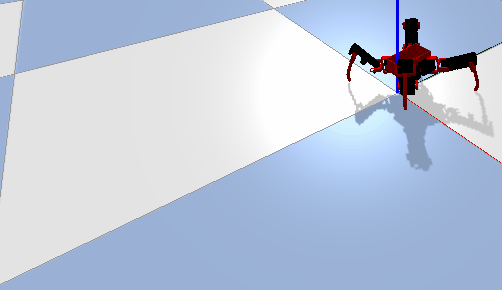

[](https://github.com/matagno/spiderbot-simulation/blob/master/README.md)
[](https://github.com/matagno/spiderbot-simulation/blob/master/README.fr.md)

# 🕷️ SpiderBot Simulation - Robot_Bullet_Simulation

Une simulation complète d'un robot araignée (quadrupède) utilisant **PyBullet** pour la physique et le contrôle cinématique inverse. Ce projet propose plusieurs modes de contrôle et déplacements autonomes.



## 📋 Table des matières

- [Caractéristiques](#-caractéristiques)
- [Architecture du projet](#-architecture-du-projet)
- [Installation](#-installation)
- [Utilisation](#-utilisation)
- [Modes de fonctionnement](#-modes-de-fonctionnement)
- [Structure URDF](#-structure-urdf)
- [Contrôles](#-contrôles)
- [Cinématique Inverse](#-cinématique-inverse)
- [Références](#-références)

---

## ✨ Caractéristiques

- **Simulation physique réaliste** avec PyBullet
- **3 versions de modèles URDF** (V1, V2, V3) avec géométries de collision
- **Cinématique inverse** pour contrôle cartésien des pattes
- **3 modes de contrôle** :
  - Mode autonome avec marche en trot
  - Mode manuel avec contrôle articulaire
  - Mode cartésien pour contrôle direct des pieds
- **Trajectoires programmées** :
  - Déplacement en ligne droite (trot)
  - Rotation sur place

---

## 🏗️ Architecture du projet

### Fichiers principaux

```
spiderbot-simulation/
├── main.py                      # Point d'entrée principal
├── robot.py                     # Classe Robot - cinématique et mouvement
├── kinematics.py                # Cinématique inverse (IK)
├── interface.py                 # Interface de contrôle et paramètres debug
├── world_simulate.py            # Gestion de la simulation et environnement
├── Robot_mesh_urdf_V1/          # Modèle V1 du robot (RobotSpider)
├── Robot_mesh_urdf_V2/          # Modèle V2 du robot (RobotProto)
├── Robot_mesh_urdf_V3/          # Modèle V3 du robot (RobotSpider amélioré)
└── tools/                       # Utilitaires (générateur VHACD pour collision)
```

### Classes principales

#### `Robot` (robot.py)
- **`__init__`** : Initialisation du robot avec URDF
- **`manual_move()`** : Contrôle manuel des articulations
- **`manual_cart_move()`** : Contrôle cartésien des pattes
- **`autonomous_move()`** : Marche autonome avec trot
- **`update_joint_axes()`** : Affichage de debug des axes des joints

#### `WorldSimulate` (world_simulate.py)
- **`__init__`** : Initialisation du client PyBullet, environnement
- **`load_world()`** : Chargement du plan (plane.urdf)
- **`load_object()`** : Chargement du robot URDF
- **`create_heightfield_ground()`** : Génération de terrain variable

#### `Interface` (interface.py)
- **`init_auto()`** : Paramètres pour mode autonome
- **`init_manual()`** : Paramètres pour mode manuel
- **`init_manual_cart()`** : Paramètres pour mode cartésien
- **`end_mode()`** : Nettoyage des paramètres debug

#### `ik_leg()` (kinematics.py)
Calcul cinématique inverse pour une patte :
- **Entrée** : Position cible (x, y, z)
- **Sortie** : Angles articulaires [hip, knee, foot]
- **Paramètres** : Longueurs des segments (coxa, tibia, tarse)

---

## 📦 Installation

### Prérequis
- Python 3.8+
- PyBullet
- NumPy
- keyboard

### Installation des dépendances

```bash
pip install pybullet numpy keyboard
```

---

## 🚀 Utilisation

### Lancer la simulation

```bash
python main.py
```

### Mode Debug

Pour activer le mode debug (affichage des axes des joints) :

```python
debug = True  # Dans main.py ligne 13
```

---

## 🎮 Modes de fonctionnement

### 1️⃣ Mode Autonome

**Activation** : Cliquez sur le bouton "Mode Auto" dans l'interface debug

**Fonctionnalités** :
- ✅ Marche en trot (avant/arrière)
- ✅ Rotation sur place
- ✅ Levée dynamique des pattes (70mm de hauteur)

**Paramètres disponibles** :
- `Run` : Active/désactive le déplacement
- `Turn` : Active/désactive la rotation
- `Rotation angle` : Angle de rotation cible (-π à +π)

**Gait (Marche)**
- Période : 0.25s
- 4 pattes en configuration trot (diagonales)
  - Pattes avant-droit (AVD) + arrière-gauche (ARG) en phase
  - Pattes avant-gauche (AVG) + arrière-droit (ARD) décalées de T/2

### 2️⃣ Mode Manuel (Articulaire)

**Activation** : Cliquez sur le bouton "Mode Manuel" dans l'interface debug

**Fonctionnalités** :
- 🎯 Contrôle direct de 12 articulations (3 par patte)
- Plages de mouvement précises pour chaque joint

**Articulations par patte** :
- **H** (Hip) : Rotation à la base, ±1.57 rad (±90°)
- **V1** (Vertical 1) : Première articulation verticale, ±1.57 rad
- **V2** (Vertical 2) : Deuxième articulation verticale, -2.36 à +0.79 rad

### 3️⃣ Mode Cartésien

**Activation** : Cliquez sur le bouton "Mode Manuel Patte" dans l'interface debug

**Fonctionnalités** :
- 🦵 Contrôle direct de la position (x, y, z) de chaque pied
- Calcul automatique des angles via cinématique inverse

**Plages de mouvement** :
- X : -200 à +200 mm
- Y : -200 à +200 mm
- Z : -200 à 0 mm

---

## 🦴 Structure URDF

### Anatomie du robot

Le robot possède **4 pattes** (ARD, ARG, AVD, AVG) avec chacune **3 articulations** :

```
Base (Chassis)
├── ARD (Arrière-Droit)
│   ├── Hip
│   ├── Knee (Tibia)
│   └── Foot (Tarse)
├── ARG (Arrière-Gauche)
│   ├── Hip
│   ├── Knee
│   └── Foot
├── AVD (Avant-Droit)
│   ├── Hip
│   ├── Knee
│   └── Foot
└── AVG (Avant-Gauche)
    ├── Hip
    ├── Knee
    └── Foot
```

### Modèles disponibles

| Version   | Nom           | Utilisation   |
|-----------|---------------|---------------|
|   V1      | RobotSpider   |   Original    |
|   V2      | RobotProto    |   Prototype   |
|   V3      | RobotSpider   | Version final |

---

## ⌨️ Contrôles

### Dans la simulation (interface debug PyBullet)

- **Boutons Mode** : Sélectionnez le mode souhaité
- **Sliders** : Ajustez les paramètres selon le mode actif
- **Caméra** :
  - Clic droit + déplacement : Rotation
  - Clic droit + Ctrl + déplacement : Zoom
  - Clic droit + Maj + déplacement : Panoramique

### Clavier

- **Q** : Quitter la simulation

---

## 📐 Cinématique Inverse

### Formule générale

Pour une patte avec segments (coxa, tibia, tarse), la cinématique inverse calcule :

**Hip** : Rotation à la base
$$\text{hip} = \frac{\pi}{2} - \arctan2(y, x)$$

**Knee et Foot** : Géométrie du triangle formé par les segments

### Paramètres par défaut

```python
coxa = 60 mm            # Segment de base (coxa)
tibia = 76.84 mm        # Segment intermédiaire (tibia)
tarse = 128.05 mm       # Segment terminal (tarse)
offset_foot_angle = 0.15708 rad  # Offset d'angle du pied (~9.5°)
```

---

## 📚 Références

### Documentation PyBullet
- [PyBullet GitHub](https://github.com/bulletphysics/bullet3)
- [PyBullet Quickstart](https://docs.google.com/document/d/10sXEhzFRSnvFcl3XxNGhnD4N2SedqwdAvK3dsihxVUA/)

### Fichiers URDF
- Format URDF : Unified Robot Description Format
- Fichiers STL : Fichiers de mailles 3D pour la visualisation et collision

---
